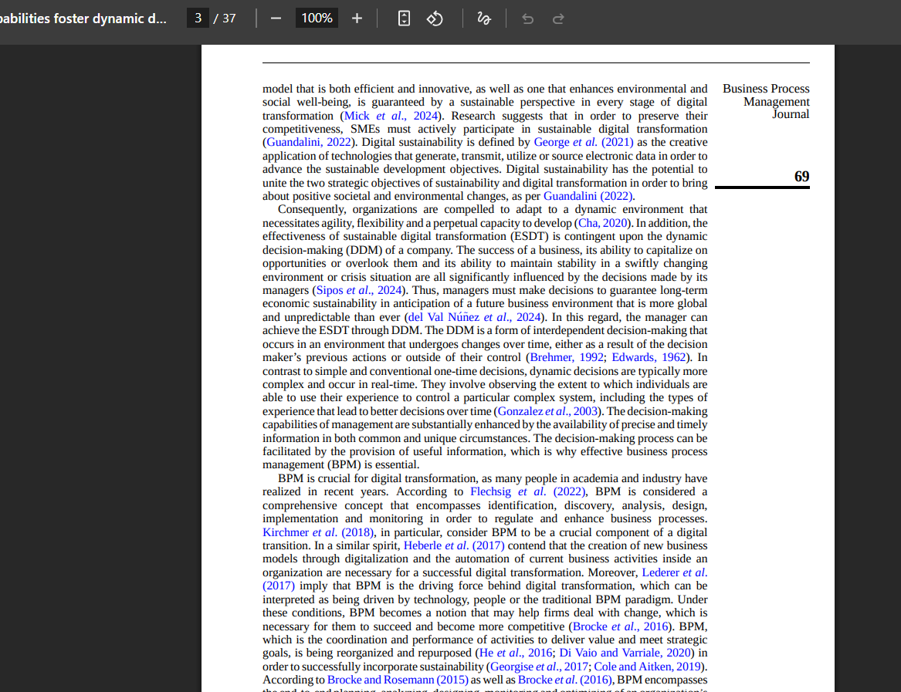
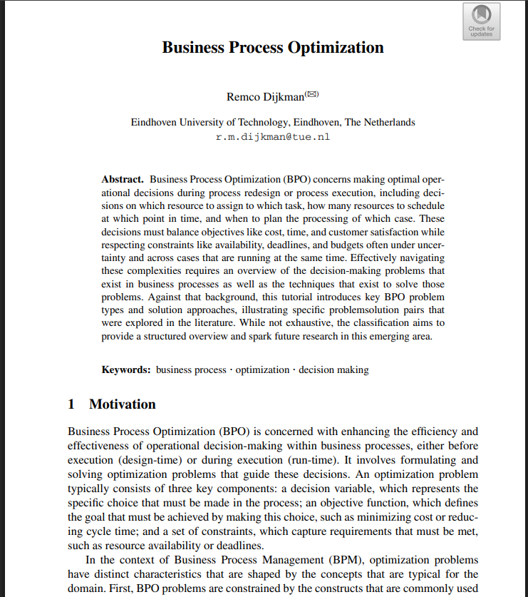
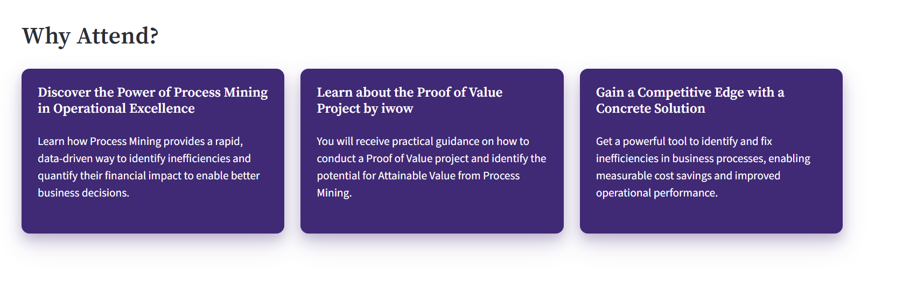
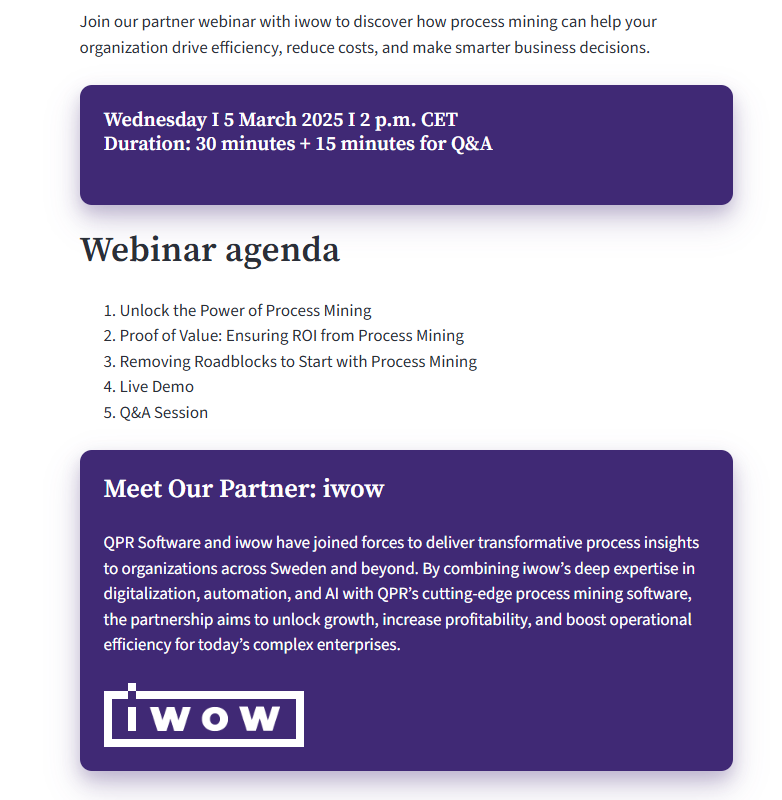
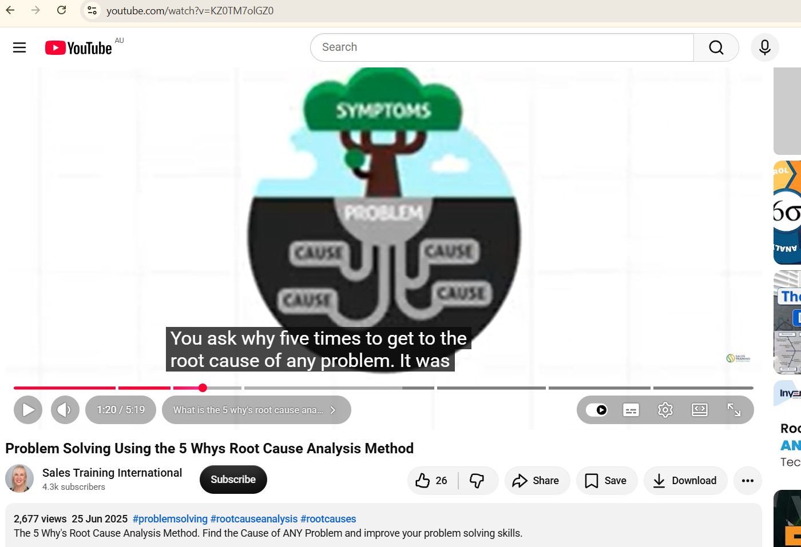

# COIT20252  Business Process Management
# e-Portfolio 1: Process Analysis

**Student Name:** Sayed Ali Noor Haque

**Student Number:** 12311704

**Unit:** COIT20252 Business Process Management

## Submitted to: 

Ahsan Morshed
Unit Coordinator

Shakir Karim
Tutor

# Introduction

This e-Portfolio demonstrates my developing understanding of Business Process Management (BPM) and process analysis across Weeks 1–3. The four selected artefacts explore the importance of **BPM, business process optimisation, process analysis using data, and Root Cause Analysis**. Together, they demonstrate my learning progression from understanding fundamental BPM concepts to analysing process problems and identifying opportunities for effective process improvement.

# Artefact 1

## Title
**What is Business Process Management (BPM)? Why Does BPM Matter?**

## Type: Journal Article (2025)

 **Source**

Pham, Q.H. & Vu, K.P. (2025), ‘Unveiling how business process management capabilities foster dynamic decision-making for effectiveness of sustainable digital transformation’, *Business Process Management Journal*, vol. 31, no. 8, pp. 67–103.

https://doi.org/10.1108/BPMJ-06-2024-0467

## DOI: https://doi.org/10.1108/BPMJ-06-2024-0467

*Figure 1: BPM encompasses process identification, discovery, analysis, design, implementation and monitoring to regulate and enhance business processes (Pham & Vu, 2025, p. 69).*

**Summary**

This journal article explains that Business Process Management (BPM) is more than improving individual business processes. It discusses how BPM capabilities help organisations make better decisions, respond to changing business environments and support sustainable digital transformation.The authors explain that BPM integrates process identification, analysis, design, implementation and monitoring to improve organisational performance and achieve strategic goals (Pham & Vu, 2025, pp. 69–70).

**Reflection**

As an Information Systems student working in customer service, I realised that well-managed business processes can improve service quality, reduce delays and create a better customer experience. I selected this article because it strengthened my understanding of the importance of BPM, which was introduced in Week 1 (Galea, 2026). Before studying this topic, I thought BPM mainly focused on documenting business processes. After reading this article and reviewing the lecture, I realised that BPM is a strategic management approach that supports decision-making, continuous improvement and organisational performance. This artefact helped me connect the theoretical concepts from Week 1 with a real-world research example and showed me why BPM is essential for organisations operating in a rapidly changing digital environment.

---

# Artefact 2

## Title
Business Process Optimization 

**Type**:
Peer-reviewed Conference Contribution / Proceedings (2025)

**Source**

Dijkman, R.M. (2025), ‘Business Process Optimization’, in A. Senderovich, C. Cabanillas, I. Vanderfeesten & H.A. Reijers (eds), *Business Process Management: 23rd International Conference, BPM 2025, Seville, Spain, August 31–September 5, 2025, Proceedings*, Lecture Notes in Computer Science, vol. 16044, Springer, Cham, pp. 13–16.

## https://doi.org/10.1007/978-3-032-02867-9_2

*Figure 2: Business Process Optimization and operational decision-making (Dijkman, 2025, p. 13).*

**Summary**

Dijkman (2025) explains Business Process Optimization (BPO) as the use of quantitative methods to improve operational decisions in business processes. The artefact focuses on optimisation during process redesign and execution, including decisions about resource allocation, scheduling, cost, time and customer satisfaction. It demonstrates how systematic optimisation can support better process performance rather than relying on informal improvement decisions (Dijkman, 2025, pp. 13–16).

**Reflection**

I selected this artefact because it extended my Week 2 understanding of the BPM life cycle. I learned that process improvement should continue beyond initial analysis and design, with processes being evaluated and optimised over time. Before studying this topic, I thought process changes were mainly made when problems occurred. I now understand that continuous optimisation supports performance, customer value and better organisational decisions.

# Artefact 3

## Title
Why Process Analysis? Understanding and Improving Business Processes

## Type: Educational / Professional Webinar (2025)

Source:
QPR Software (2025), *Turn Your Business Processes into Goldmines – Drive Operational Excellence with Process Mining*, webinar, 5 March 2025.

*Figure 3a: Process mining as a data-driven approach to identifying inefficiencies and improving operational performance (QPR Software, 2025).*

*Figure 3b: QPR Software process mining webinar agenda, held on 5 March 2025 (QPR Software, 2025).*

**Summary**

This webinar explains how process mining provides a data-driven approach to identifying inefficiencies in business processes and measuring their financial impact. It demonstrates how organisations can identify improvement opportunities, reduce costs and improve operational performance. The webinar also shows how evidence from process mining can support better business decisions and continuous process improvement (QPR Software, 2025).

**Reflection**

I selected this webinar because it strengthened my understanding of process analysis from Week 3. Previously, I thought process problems were mainly identified through observation. I learned that process data can provide evidence about inefficiencies and their impact on organisational performance. This helped me understand why organisations should analyse their current processes and gather relevant evidence before deciding how a process should be improved.

# Artefact 4

## Title
Root Cause Analysis: Using the 5 Whys to Identify Process Problems

## Type: Educational YouTube Video (2025)

**Source**

Sales Training International (2025), *Problem Solving Using the 5 Whys Root Cause Analysis Method*, YouTube video, 25 June 2025.

Watch Problem Solving Using the 5 Whys Root Cause Analysis Method

Figure 4: The 5 Whys method distinguishes visible symptoms from the underlying causes of a problem (Sales Training International, 2025, 1:20).

**Summary**

This video explains the 5 Whys as a Root Cause Analysis technique used to investigate the underlying causes of problems rather than focusing only on visible symptoms. It demonstrates how repeatedly asking “Why?” can move the analysis from a problem towards its deeper causes. This structured approach can help identify the actual reason behind a process problem before selecting an appropriate solution (Sales Training International, 2025, 1:20).

**Reflection**

I selected this video because Root Cause Analysis was an important part of my Week 3 learning. Previously, I thought identifying a process problem was enough to begin fixing it. I now understand that the visible problem may only be a symptom of deeper causes. The 5 Whys technique helped me understand why analysts should investigate underlying causes before recommending process improvements.

# References

Dijkman, R.M. (2025) ‘Business Process Optimization’, in Senderovich, A., Cabanillas, C., Vanderfeesten, I. & Reijers, H.A. (eds), *Business Process Management: 23rd International Conference, BPM 2025, Seville, Spain, August 31–September 5, 2025, Proceedings*, Lecture Notes in Computer Science, vol. 16044, Springer, Cham, pp. 13–16, https://doi.org/10.1007/978-3-032-02867-9_2.

Galea, D. (2026) *COIT20252 Business Process Management: Week 1 lecture slides*, CQUniversity, Moodle.

Pham, Q.H. & Vu, K.P. (2025) ‘Unveiling how business process management capabilities foster dynamic decision-making for effectiveness of sustainable digital transformation’, *Business Process Management Journal*, vol. 31, no. 8, pp. 67–103, https://doi.org/10.1108/BPMJ-06-2024-0467.

QPR Software (2025) *Turn Your Business Processes into Goldmines – Drive Operational Excellence with Process Mining*, webinar, 5 March 2025.

Sales Training International (2025) *Problem Solving Using the 5 Whys Root Cause Analysis Method*, YouTube video, 25 June 2025, https://www.youtube.com/watch?v=KZ0TM7olGZ0.

# AI Use Statement

Generative AI was used during the planning and initial idea development of this assessment. All artefacts were independently reviewed, and the reflections were written and checked by me. I take responsibility for the final submitted work.
