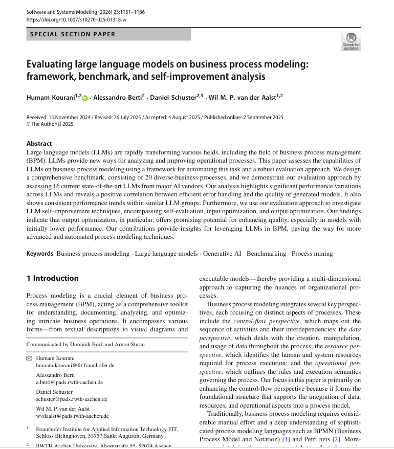
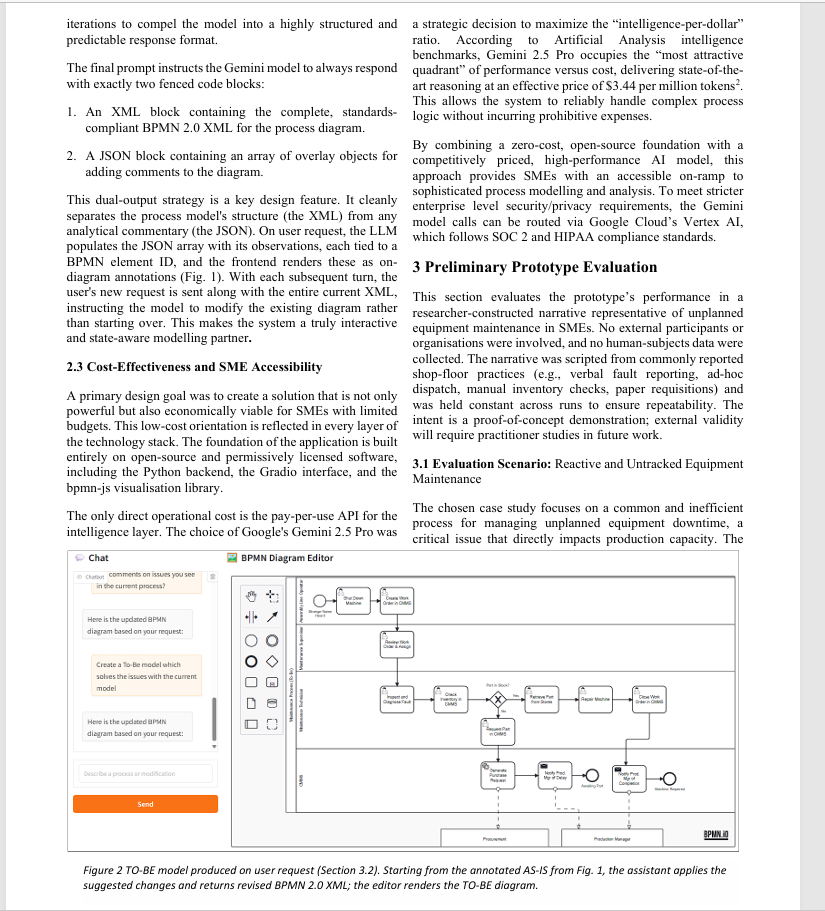
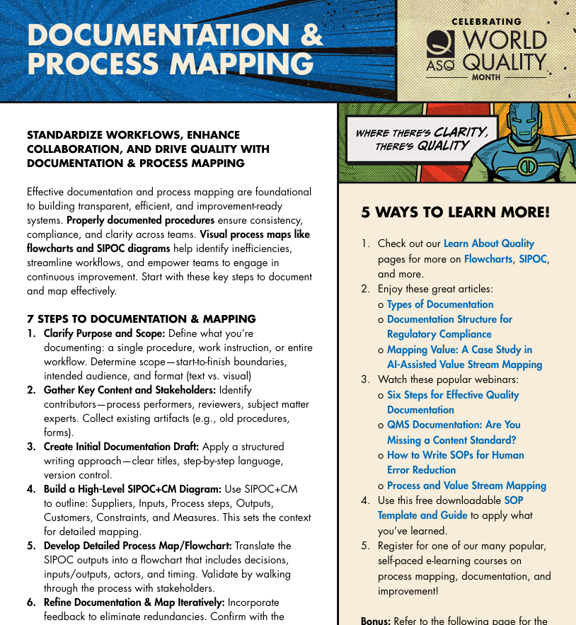
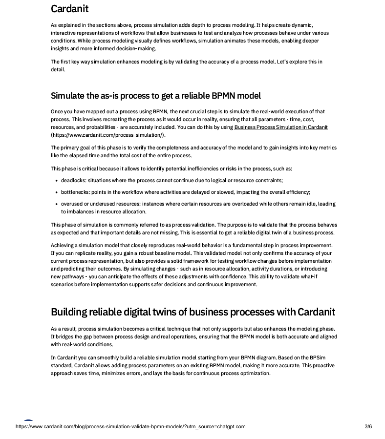
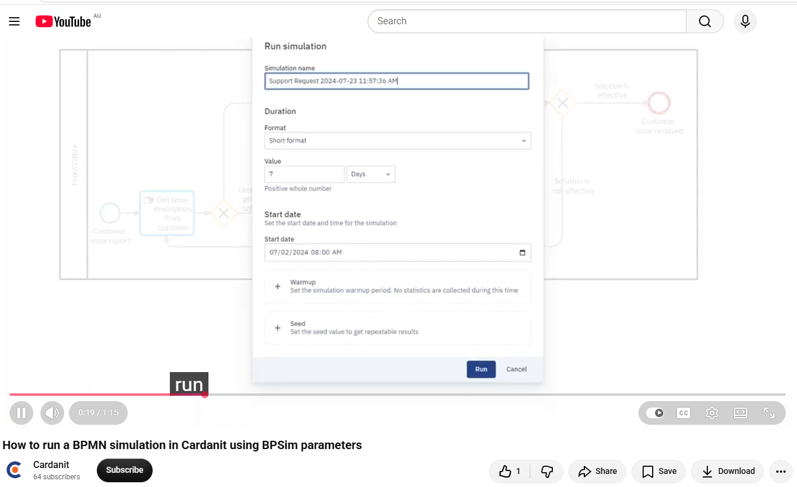

# COIT20252 – Business Process Management

## e-Portfolio 2: Business Process Modelling

**Student Name:** Sayed Ali Noor Haque  
**Student Number:** 12311704  
**Unit:** COIT20252 Business Process Management  

**Submitted to:**  
Ahsan Morshed – Unit Coordinator  
Shakir Karim – Tutor  

---

## Introduction

This e-Portfolio demonstrates my developing understanding of **Business Process Modelling** across Weeks 4–5. The four selected artefacts explore **process models and modelling notation, AS-IS and TO-BE modelling, SIPOC process mapping, and process validation and simulation**. Together, they demonstrate my learning progression from understanding how business processes are represented to analysing, redesigning, and evaluating processes for effective business improvement.
---

## Artefact 1 – Business Process Modelling and BPMN

**Type:** Peer-reviewed Journal Article (2025)

**Source:** Kourani, H., Berti, A., Schuster, D. & van der Aalst, W.M.P. (2025), *Evaluating large language models on business process modeling: framework, benchmark, and self-improvement analysis*, *Software and Systems Modeling*, pp. 1151–1186.

**Link:** https://doi.org/10.1007/s10270-025-01318-w

*Figure 1: Business process modelling as a key element of BPM for understanding, documenting, analysing and improving organisational processes (Kourani et al., 2025, p. 1151).*

### Summary

This journal article explains that business process modelling is an important part of Business Process Management (BPM). It represents the activities, decisions and flow of a business process in a formal way. Clear process models help organisations understand how work is performed, identify inefficiencies and communicate process knowledge among stakeholders (Kourani et al., 2025, pp. 1152–1153). The article also explains that process models support analysis and improvement before changes are implemented. In addition, BPMN is identified as a widely used modelling notation because its graphical approach can represent both simple and complex business processes (Kourani et al., 2025, p. 1153).

### Reflection

I selected this article because it developed my understanding of business process modelling and connected strongly with the Week 4 learning materials. Before studying this topic, I thought process models were mainly simple flowcharts used to show activities. After reviewing this article, I learned that process modelling can also support process analysis, communication and improvement (Kourani et al., 2025, pp. 1152–1153). I also developed a better understanding of BPMN as a standard notation for representing activities, events and decisions in a process (Kourani et al., 2025, p. 1153). This knowledge will help me create clearer process models and identify possible inefficiencies before suggesting improvements to a business process.

## Artefact 2 – AS-IS and TO-BE Process Modelling

AS-IS = Current process → Identify problems → Improvement → TO-BE = Future improved process

**Type:** Peer-reviewed Conference Paper (2025)

**Source:** Radhakrishnan, U. (2025), *Documenting SME Processes with Conversational AI: From Tacit Knowledge to BPMN*, paper presented at the 2025 International Workshop on Low-Cost Digital Solutions for Industrial Automation (LoDiSA 2025), Cambridge, UK, 23–24 September 2025.
(file:///C:/Users/12311704/Downloads/radhakrishnan-2025-documenting-sme-processes-with-conversational-ai-from-tacit-knowledge-to-bpmn.pdf)

**Link:** https://doi.org/10.1049/icp.2025.3640

*Figure 2: TO-BE BPMN model developed from the analysed AS-IS process to address identified process issues (Radhakrishnan, 2025, p. 4).*

### Summary

This conference paper demonstrates how AS-IS and TO-BE models can be used to analyse and improve a business process. In an equipment-maintenance scenario, an AS-IS BPMN model was first developed to represent the existing process, which included inefficient manual communication, inventory checks and paper-based requests (Radhakrishnan, 2025, p. 5). The existing model was then analysed to identify process issues. Based on this analysis, an improved TO-BE BPMN model was created to address the identified problems (Radhakrishnan, 2025, p. 5).

### Reflection

I selected this paper because it helped me understand the practical difference between AS-IS and TO-BE process modelling. Before studying this topic, I thought process modelling mainly represented the activities of an existing process. This artefact showed me that an AS-IS model can document the current process and support the identification of problems, while a TO-BE model can represent an improved future process (Radhakrishnan, 2025, p. 5). This connects strongly with my Week 4 learning and will help me compare current and improved processes more clearly when analysing business processes.

## Artefact 3 – SIPOC and High-Level Process Mapping

**Type:** Professional Industry Resource (2025)  

**Source:** American Society for Quality (ASQ) (2025), *Documentation & Process Mapping*.

**Link:** https://asq.org/-/media/public/wqm/ASQ-WQM25_Document-ProcessMapping.pdf

*Figure 3: High-level SIPOC+CM as a foundation for developing a detailed process map (ASQ, 2025, p. 1).*

### Summary

This professional resource explains how SIPOC can be used as a high-level process mapping tool to support process understanding and improvement. SIPOC identifies the Suppliers, Inputs, Process steps, Outputs and Customers involved in a process. The resource extends this to SIPOC+CM by including Constraints and Measures (ASQ, 2025, p. 1). It also explains that a high-level SIPOC diagram provides context for detailed process mapping, which can include decisions, inputs, outputs, actors and timing (ASQ, 2025, p. 1).

### Reflection

I selected this resource because it helped me understand the purpose of SIPOC as a high-level process mapping technique. Before studying this topic, I thought a process map needed to show every activity in detail. I learned that SIPOC can first provide a simple overview of the key elements and boundaries of a process before developing a more detailed process map (ASQ, 2025, p. 1). This connects strongly with my Week 4 learning and will help me define the scope of a process before analysing its detailed activities and identifying opportunities for improvement.

---

## Artefact 4 – Process Validation and Simulation

**Type:** Professional Educational Article (2025)  

**Source:** Cardanit (2025), *Process validation: how Process Simulation helps verify BPMN models*, 13 January 2025.

**supporting source:** YouTube video (https://youtu.be/1i3jMDn_IxA?si=lxF8ep3LMNIlJOKG)

**Link:** https://www.cardanit.com/blog/process-simulation-validate-bpmn-models/

*Figure 4: Process simulation used to validate a BPMN model and identify potential process inefficiencies and risks (Cardanit, 2025, p. 3).*

*Figure 4a: Running a BPMN process simulation in Cardanit using BPSim parameters (Cardanit, 2024, 0:19).*

### Summary

This professional article explains how process simulation can be used to validate BPMN models and analyse process performance. Simulation considers parameters such as time, cost, resources and probabilities to represent real-world process behaviour (Cardanit, 2025, p. 3). It can also identify problems such as bottlenecks, deadlocks and inefficient resource utilisation during process validation (Cardanit, 2025, p. 3). The supporting Cardanit video demonstrates how a BPMN simulation is configured and run using BPSim parameters (Cardanit, 2024, 0:14–0:57). Together, these resources show how simulation can move beyond a static process model to support process analysis and testing before implementation.

### Reflection

I selected this article because it is clearly related to our Week 5 lecture on process validation and simulation. The lecture introduced how simulation can validate process models, analyse performance and compare process designs. Before studying this topic, I thought reviewing the activities and flow of a BPMN model was enough to evaluate a process. This article helped me understand that simulation can identify bottlenecks, deadlocks and resource problems that may not be visible in a static model (Cardanit, 2025, p. 3). The supporting video also helped me understand practically how simulation parameters are configured and a BPMN simulation is run (Cardanit, 2024, 0:14–0:57). I learned that a validated model can provide a reliable baseline for testing possible process changes before implementation (Cardanit, 2025, p. 3). This will help me evaluate process models more carefully before recommending improvements.

## References

American Society for Quality (ASQ) 2025, *Documentation & Process Mapping*, American Society for Quality, viewed 3 September 2026, https://asq.org/-/media/public/wqm/ASQ-WQM25_Document-ProcessMapping.pdf.

Cardanit 2024, ‘How to run a BPMN simulation in Cardanit using BPSim parameters’, YouTube video, 29 October, viewed 3 September 2026, https://www.youtube.com/watch?v=1i3jMDn_IxA.

Cardanit 2025, ‘Process validation: how Process Simulation helps verify BPMN models’, 13 January, viewed 3 September 2026, https://www.cardanit.com/blog/process-simulation-validate-bpmn-models/.

Kourani, H., Berti, A., Schuster, D. & van der Aalst, W.M.P. 2025, ‘Evaluating large language models on business process modeling: framework, benchmark, and self-improvement analysis’, *Software and Systems Modeling*, https://doi.org/10.1007/s10270-025-01318-w.

Radhakrishnan, U. 2025, ‘Documenting SME processes with conversational AI: from tacit knowledge to BPMN’, paper presented at the 2025 International Workshop on Low-Cost Digital Solutions for Industrial Automation (LoDiSA 2025), Cambridge, UK, 23–24 September, https://doi.org/10.1049/icp.2025.3640.

## AI Use Statement

Generative AI was used during the planning, research and initial idea-development stages of this assessment. All selected artefacts and sources will be independently reviewed by me, and I will take responsibility for the final submitted work.
