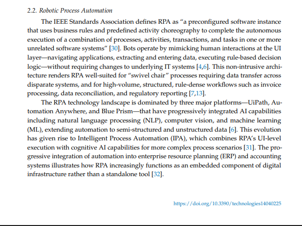
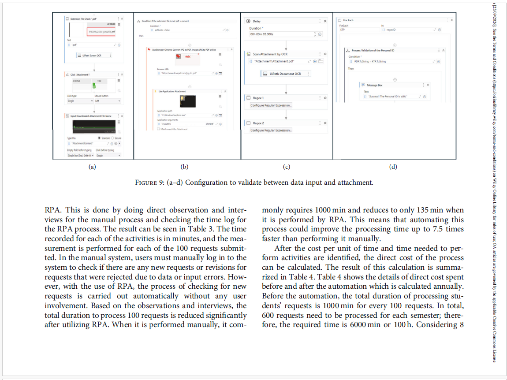
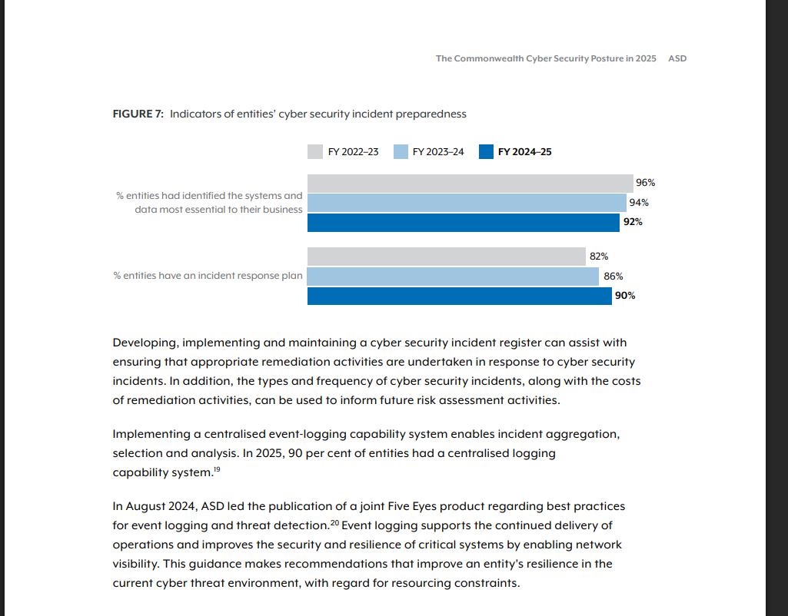
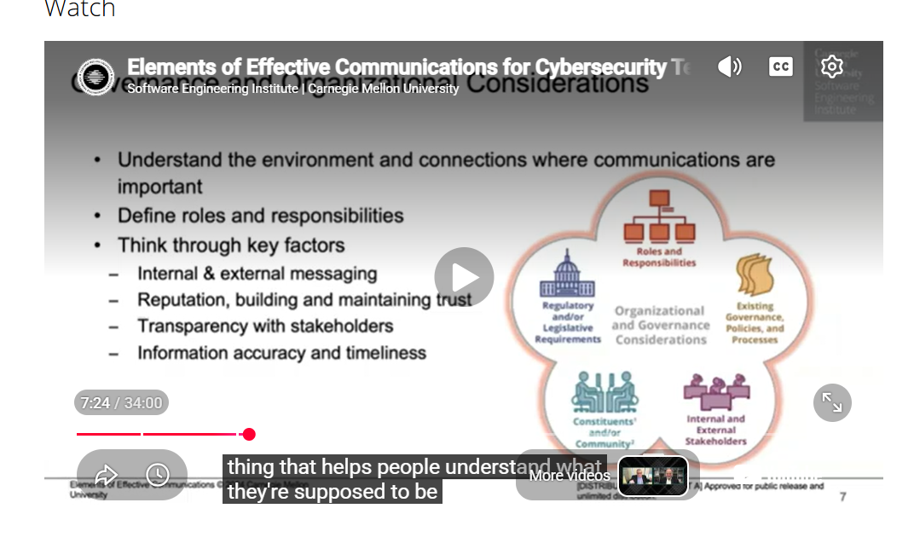

# COIT20252 – Business Process Management

## e-Portfolio 3: Robotic Process Automation and Process Cybersecurity

**Student Name:** Sayed Ali Noor Haque

**Student Number:** 12311704

**Submitted to:**

Ahsan Morshed – Unit Coordinator

Shakir Karim – Tutor

---

## Introduction

This e-Portfolio 3 demonstrates my developing knowledge and understanding of Robotic Process Automation (RPA) and Process Cybersecurity in Business Process Management (BPM). RPA can support business process improvement by automating repetitive, rule-based activities, while cybersecurity helps organisations protect their information and business operations. The four selected artefacts explore the fundamental concepts of RPA, its application in business process improvement, the importance of process cybersecurity, and cybersecurity incident response. Together, these artefacts demonstrate my learning progression from understanding how automation can improve business processes to recognising the importance of protecting business information and managing cybersecurity risks. This learning has strengthened my understanding of how organisations can improve process efficiency while maintaining secure and reliable business operations.

### Artefact 1
### Title
**Understanding Robotic Process Automation**

Robotic Process Automation (RPA) is a technology that uses software robots to automate repetitive and rule-based business tasks. It helps organisations reduce manual work, improve accuracy, and increase process efficiency (Khantong & Sriboonlue, 2026, p. 3).

**Type:** Peer-reviewed Journal Article – Systematic Literature Review (2026)

**Source:** Khantong, S. & Sriboonlue, P. (2026), ‘Robotic Process Automation in Business Process Management: A Systematic Literature Review and an Integrated Framework’, *Technologies*, vol. 14, no. 4, article 225.

**Link:** https://doi.org/10.3390/technologies14040225

 

*Figure 1: Definition of RPA and its use in automating repetitive business tasks (Khantong & Sriboonlue, 2026, p. 3).*

### Summary

This article explains how Robotic Process Automation (RPA) supports Business Process Management (BPM). RPA uses software robots to automate repetitive and rule-based tasks by interacting with computer applications. It can support activities such as data entry, invoice processing, and transferring information between systems (Khantong & Sriboonlue, 2026, p. 3). The authors review 83 academic studies and discuss how RPA relates to process selection, implementation, performance improvement, and organisational governance (Khantong & Sriboonlue, 2026, p. 1).

### Reflection

I selected this article because it helped me understand that RPA is not only about completing tasks faster. I learned that organisations should analyse their existing processes and identify suitable activities before introducing automation (Khantong & Sriboonlue, 2026, p. 4). For example, routine inventory data entry could be considered for RPA, while physical stock checks and unusual discrepancies would still require human involvement. This connects with BPM because process analysis can help organisations decide which activities to automate and which activities still need human involvement.

---

## Artefact 2
### Title
**RPA in Business Process Improvement**

**Type:** Peer-reviewed Empirical Research Article (2025)

**Source:** Gunawan, A. et al. (2025), ‘Empirical Study of Robotic Process Automation: Implementation and Evaluation’, *Human Behavior and Emerging Technologies*, vol. 2025, article 2876164.

**Link:** https://doi.org/10.1155/hbe2/2876164

*Figure 2: Comparison of manual and RPA processing time for student requests (Gunawan et al., 2025, p. 11).*

### Summary

This article demonstrates how RPA can improve a business process through a real implementation in a university student service centre. The researchers analysed the existing process before designing and implementing an RPA solution to automate student data validation (Gunawan et al., 2025, p. 7). The results showed a significant improvement in processing time. Processing 100 student requests manually required 1,000 minutes, while RPA reduced this to 135 minutes, making the process approximately 7.5 times faster (Gunawan et al., 2025, p. 11).

### Reflection

I selected this artefact because it showed me how RPA can improve a real business process rather than only explaining the technology. I learned that organisations should first analyse the existing process and identify suitable activities for automation (Gunawan et al., 2025, p. 7). The comparison between manual and automated processing also helped me understand how BPM can use measurable results to evaluate process improvement (Gunawan et al., 2025, p. 11). This demonstrates that automation decisions should be supported by process analysis and performance evidence.

---

## Artefact 3
### Title

**Process Cybersecurity**

**Type:** Australian Government Cybersecurity Report (2026)

**Source:** Australian Signals Directorate (ASD) (2026), *The Commonwealth Cyber Security Posture in 2025*, Australian Government.

**Link:** https://www.cyber.gov.au/about-us/view-all-content/reports-and-statistics/the-commonwealth-cyber-security-posture-in-2025

*Figure 3: Indicators of Australian Government entities’ cyber security incident preparedness (Australian Signals Directorate, 2025, p. 15).*

### Summary

This report examines the cybersecurity practices of Australian Government entities and highlights the importance of preparing for cybersecurity incidents. Cyber resilience involves an organisation’s ability to detect and manage cybersecurity events while continuing important business operations (Australian Signals Directorate, 2025, p. 14). The report explains that organisations should identify essential systems and data, include cybersecurity incidents in business continuity planning, and develop and test incident response plans (Australian Signals Directorate, 2025, p. 14). In 2025, 90% of surveyed entities had an incident response plan, showing a stronger focus on cybersecurity preparedness (Australian Signals Directorate, 2025, p. 15).

### Reflection

I selected this report because it improved my understanding of the relationship between cybersecurity and business processes. I learned that cybersecurity is not only a technical responsibility, as a cyber incident can also interrupt important business operations (Australian Signals Directorate, 2025, p. 14). The report also showed me that organisations need clear incident response plans to prepare for possible disruptions (Australian Signals Directorate, 2025, p. 15). From a BPM perspective, I now understand that an effective business process should not only be efficient but also secure and able to continue during unexpected disruptions.

---

## Artefact 4
### Title

**Cybersecurity Incident Response**

**Type:** Professional Cybersecurity Webcast (2025)

**Source:** Mudd, S. (2025), *Elements of Effective Communications for Cybersecurity Teams*, Carnegie Mellon University Software Engineering Institute.

**Link:** https://www.sei.cmu.edu/library/elements-of-effective-communications-for-cybersecurity-teams/

*Figure 4a: Organisational and governance considerations for effective cybersecurity communication (Mudd, 2025, 7:24).*

### Summary

This webcast explains the importance of effective communication in cybersecurity and incident management. Mudd explains that organisations should clearly define roles and responsibilities and consider internal and external communication, stakeholder transparency, trust, and the accuracy and timeliness of information (Mudd, 2025, 7:24). The webcast also identifies professional resources that can support cybersecurity incident management, including guidance from SEI, NIST and the FIRST CSIRT Services Framework (Mudd, 2025, 30:50). These resources show that effective incident management requires both technical preparation and organised communication.

### Reflection

I selected this webcast because it helped me understand the importance of communication during cybersecurity incidents. I learned that organisations need clear responsibilities and effective communication with both internal and external stakeholders (Mudd, 2025, 7:24). This connects with BPM because a cybersecurity incident can interrupt normal business processes, and employees need to understand their responsibilities when responding to the incident. From this artefact, I learned that effective incident response requires not only cybersecurity controls but also clear communication and well-defined responsibilities.

---

## References

Australian Signals Directorate (ASD) 2025, *The Commonwealth Cyber Security Posture in 2025*, Australian Government, November 2025, viewed 25 September 2026, <https://www.cyber.gov.au/about-us/view-all-content/reports-and-statistics/the-commonwealth-cyber-security-posture-in-2025>.

Gunawan, A., Wijaya, M.I., Andika, N. & Lius, A. 2025, ‘Empirical study of robotic process automation: Implementation and evaluation’, *Human Behavior and Emerging Technologies*, vol. 2025, article 2876164, viewed 25 September 2026, <https://doi.org/10.1155/hbe2/2876164>.

Khantong, S. & Sriboonlue, P. 2026, ‘Robotic process automation in business process management: A systematic literature review and an integrated framework’, *Technologies*, vol. 14, no. 4, article 225, viewed 25 September 2026, <https://doi.org/10.3390/technologies14040225>.

Mudd, S. 2025, *Elements of effective communications for cybersecurity teams*, webcast, Software Engineering Institute, Carnegie Mellon University, 28 February, viewed 25 September 2026, <https://www.sei.cmu.edu/library/elements-of-effective-communications-for-cybersecurity-teams/>.

---

## AI Use Statement

ChatGPT was used to support the planning and research stages of this assessment, including identifying relevant sources, organising ideas and improving the clarity. All selected artefacts (1,2,3,4) and sources were reviewed and verified by me. The final content was reviewed and edited by me, and I take responsibility for the submitted work.
